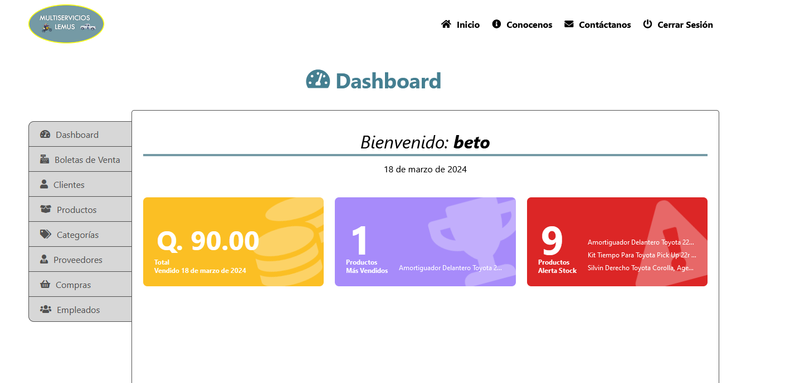
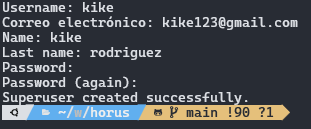
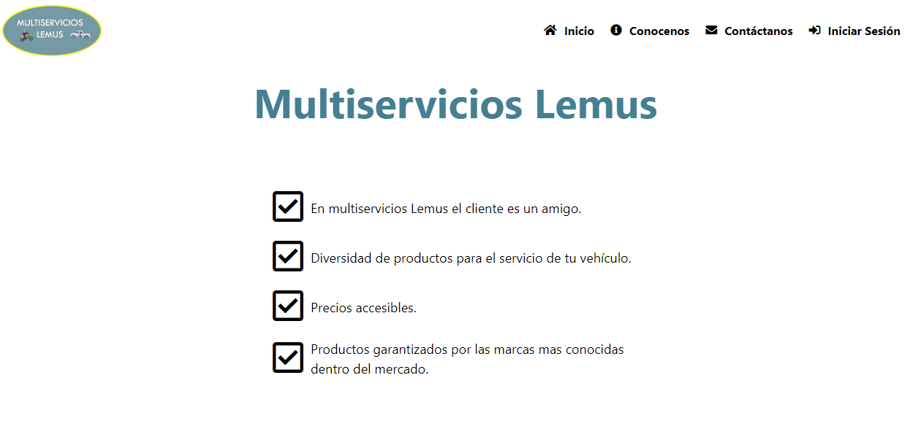
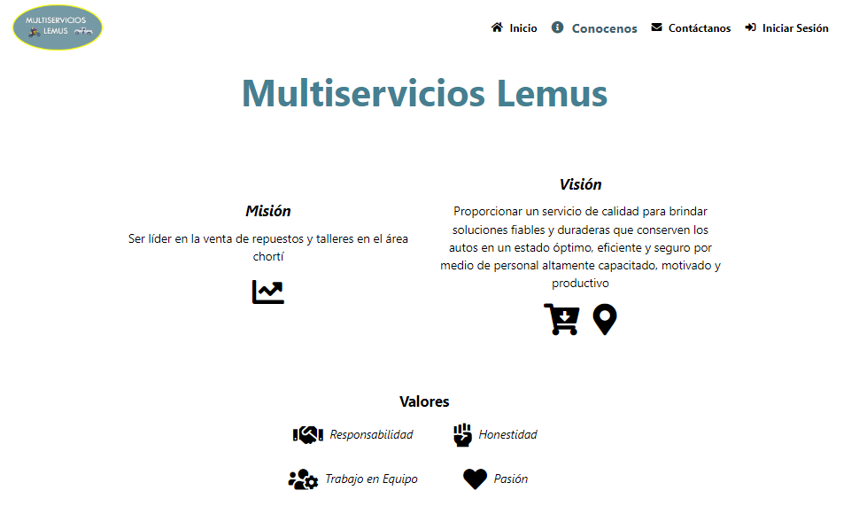
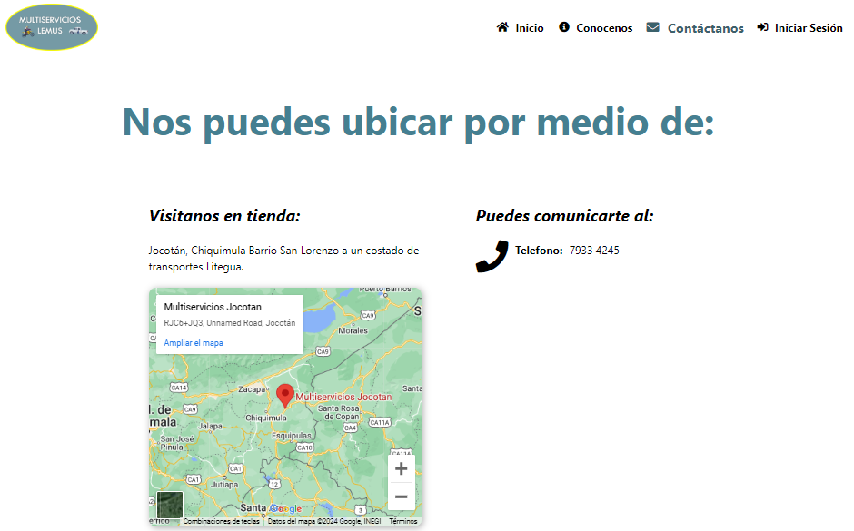
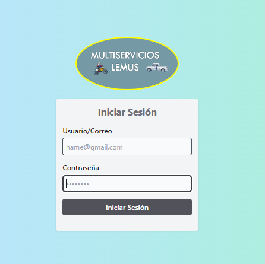
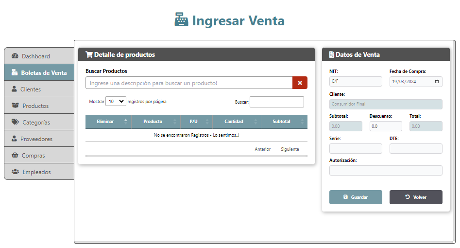

<a name="readme-top"></a>

<div align="center">

# Horus👨‍🔧🚘

[](./README.md)
[](./README.es.md)


Horus es el nombre base de este proyecto, que es una aplicación web para controlar las ventas de repuestos y servicios para un taller mecánico.

Lo requería un pequeño taller que quería controlar el flujo de ingresos, así como el inventario de los productos o repuestos que utilizaban en cada servicio.



Visite el [sitio web] de prueba (https://xtestuser.pythonanywhere.com/) para saber más.
Utilice estas credenciales: nombre de usuario: **admin** contraseña: **abc123/-**
</div>

----


## 📖 Instalación
#### Download this repository

> Se recomienda utilizar un entorno virtual para la instalación de dependencias..!

- virtualenwrapper
```bash
mkvirtualenv (name env)
```

- virtualenv/venv
```bash
python -m venv (name env)
```
> Activación del entorno virtual
- virtualenwrapper
```bash
workon (name env)
```

- virtualenv/venv
```bash
(name env)\Scripts\activate
```

> **Instalando las dependencias**
Para instalar las dependencias, debe ubicarlas en el nivel del archivo **requirements.txt** y ejecutar el siguiente comando:
```bash
pip install -r requirements.txt
```
> **Realización de migraciones de bases de datos**
Ejecutar migraciones de bases de datos

Este comando prepara las migraciones para crear las tablas en la base de datos.
```bash
python manage.py makemigrations
```
El comando migrar genera las migraciones en la base de datos creando las tablas
```bash
python manage.py migrate
```

##### Crear un nuevo usuario
Para crear un nuevo usuario en la aplicación es necesario ejecutar el siguiente comando:
```bash
pip install -r requirements.txt
```
> Para configurar el servidor debemos estar al nivel del archivo **manage.py**
```bash
python manage.py runserver
```
> Teniendo nuestra base de datos con sus tablas, es necesario crear un superusuario con el siguiente comando:
```bash
python3 manage.py createsuperuser
```
Nos pedirá:
- nombre de usuario
- correo electrónico
- nombre
- apellido
- contraseña
- repite la contraseña
Si todo esta ok mostrara el siguiente mensaje


#### Ejecute el servidor e inicie 🚀 la aplicación web 💻
Si todo funcionó correctamente debería mostrar que la aplicación se está ejecutando mostrando la dirección y el puerto.


----

## ⚙️ Uso básico de la aplicación web.
Luego de configurar el servidor, al ingresar a la aplicación nos mostrará la página de inicio.

<details>
<summary>Landgin</summary>

##### Página de inicio
La página de inicio muestra las opciones que se pueden encontrar en Lemus multiservicios, empresa para la que fue desarrollada la aplicación.


##### Acerca de
La página conócenos muestra la visión, misión y valores que rigen la empresa.


##### Contacto
La página de contacto muestra la ubicación obtenida de Google Maps, así como el teléfono de contacto.

</details>


<details open>
<summary>Aplicación web</summary>

##### Inicio de Sesion
Esta página muestra el formulario para iniciar sesión como usuario.


##### Dashboard
El tablero es la página principal donde se puede obtener información rápida sobre la aplicación, para poder tomar decisiones en base a la información.


##### Ingresar venta
El registro de ventas es una de las partes fundamentales para la aplicación ya que es uno de los controles mediante el cual se llevó a cabo su desarrollo.


##### Compras
Compras es donde gestionamos el inventario de los productos, y es parte fundamental de la aplicación ya que si no hay compras registradas no tendremos stock y no se podrá realizar la venta.


</details>

**Gracias por todo, estás invitado a contribuir o aportar ideas o temas.**

[](https://github.com/devkev53/horus/graphs/contributors)

<p align="right">(<a href="#readme-top">volver arriba</a>)</p>

----


## 🛠️ Stack

* - Un lenguaje de programación que le permite trabajar rápidamente e integrar sistemas de manera más efectiva.
*  - Facilita la creación de mejores aplicaciones web con mayor rapidez y con menos código.
*  - Lenguaje de programación interpretado, un dialecto de ECMAScript.
*  - Sistema de gestión de bases de datos relacionales orientado a objetos.
