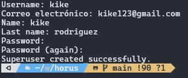
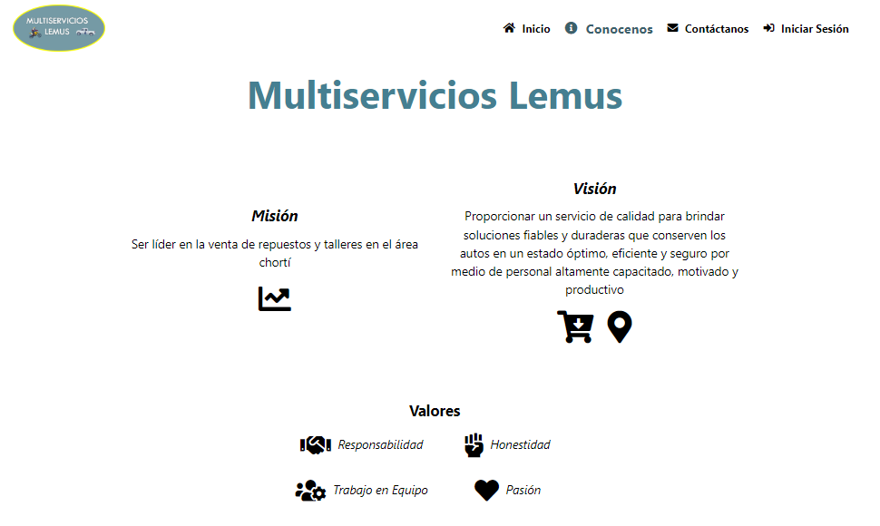
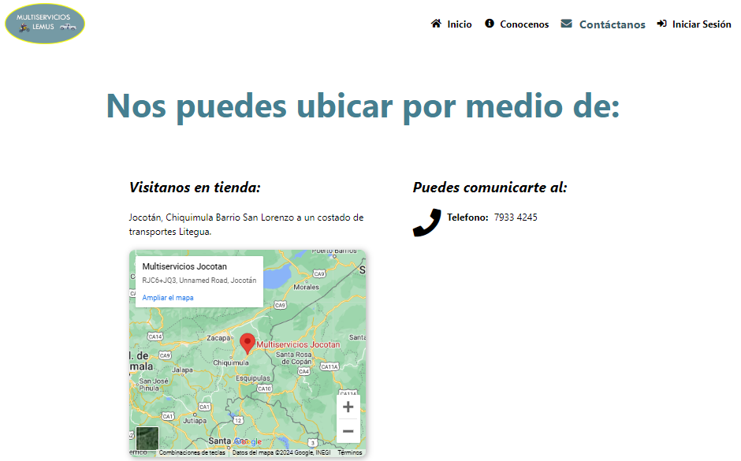

<a name="readme-top"></a>

<div align="center">

# Horus👨‍🔧🚘

[](./README.md)
[](./README.es.md)


Horus is the base name for this project, which is a web application to control sales of spare parts and services for a mechanical workshop.

It was required by a small workshop which wanted to control the flow of income, as well as the inventory of the products or spare parts they used in each service.


Visit the test [website](https://xtestuser.pythonanywhere.com/) to know more.
Use this credentials: username: **admin** password: **abc123/-**
</div>

----


## 📖 Installation
#### Download this repository

> It is recommended to use a virtual environment for the installation of dependencies..!

- virtualenwrapper
```bash
mkvirtualenv (name env)
```

- virtualenv/venv
```bash
python -m venv (name env)
```
> Activation of the virtual environment
- virtualenwrapper
```bash
workon (name env)
```

- virtualenv/venv
```bash
(name env)\Scripts\activate
```

> **Installing the dependencies**
To install the dependencies, you must locate them at the **requirements.txt** file level and run the following command:
```bash
pip install -r requirements.txt
```
> **Performing Database Migrations**
Run database migrations

This command prepares the migrations to create the tables in the database
```bash
python manage.py makemigrations
```
The migrate command generates the migrations in the database by creating the tables
```bash
python manage.py migrate
```

##### Create a new user
To create a new user in the application it is necessary to run the following command:
```bash
pip install -r requirements.txt
```
> To set up the server we must be at the level of the **manage.py** file
```bash
python manage.py runserver
```
> Having our database with its tables, it is necessary to create a superuser with the following command:
```bash
python3 manage.py createsuperuser
```
It will ask us for the:
- username
- email
- name
- lastname
- password
- repeat the password
If everything is ok it will show the following message


#### Run the server and launch 🚀 the web application 💻
If everything worked correctly it should show that the application is running showing the address and port.


----

## ⚙️ Basic use of the web application
After configuring the server, upon entering the application it will show us the home page.

<details>
<summary>Landgin</summary>

##### Home Page
The home page shows the options that can be found in Lemus multiservices, the company for which the application was developed.


##### About
The get to know us page shows the vision, mission and values ​​that govern the company.


##### Contact
The contact page shows the location obtained from Google Maps, as well as the telephone contact.

</details>


<details open>
<summary>Web Application</summary>

##### Login
This page shows the form for user login


##### Dashboard
The dashboard is the main page where you can obtain quick information about the application, in order to make decisions based on the information.


##### Enter Sale
The sales record is one of the fundamental parts for the application since it is one of the controls by which its development was carried out.


##### Shopping
Purchasing is where we manage the inventory of the products, and it is a fundamental part of the application since if there are no registered purchases we will not have stock and the sale cannot be made.


</details>

**Thank you for everything, you are invited to contribute or provide ideas or topics.**

[](https://github.com/devkev53/horus/graphs/contributors)

<p align="right">(<a href="#readme-top">go back top</a>)</p>

----


## 🛠️ Stack

* - A programming language that lets you work quickly and integrate systems more effectively.
*  - Makes it easier to build better web apps more quickly and with less code
*  - Interpreted programming language, a dialect of the ECMAScript.
*  - Object-oriented relational database management system
