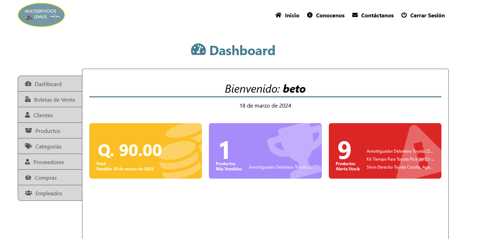

<div align="center">

# Horus👨‍🔧🚘

[](./README.md)
[](./README.es.md)


Horus is the base name for this project, which is a web application to control sales of spare parts and services for a mechanical workshop.

It was required by a small workshop which wanted to control the flow of income, as well as the inventory of the products or spare parts they used in each service.



Visit the test [website](https://xtestuser.pythonanywhere.com/) to know more.
Use this credentials: username: **admin** password: **abc123/-**
</div>


## 📖 Installation
#### Download this repository

> It is recommended to use a virtual environment for the installation of dependencies..!

- virtualenwrapper
```bash
mkvirtualenv (name env)
```

- virtualenv/venv
```bash
python -m venv (name env)
```
> Activation of the virtual environment
- virtualenwrapper
```bash
workon (name env)
```

- virtualenv/venv
```bash
(name env)\Scripts\activate
```

> **Installing the dependencies**
To install the dependencies, you must locate them at the **requirements.txt** file level and run the following command:
```bash
pip install -r requirements.txt
```
#### Create a new user

#### Run the server and launch 🚀 the web application 💻
> To set up the server we must be at the level of the **manage.py** file
```bash
python manage.py runserver
```

If everything worked correctly it should show that the application is running showing the address and port.


## ⚙️ Basic use of the web application

## 🛠️ Stack
* {height=36px}- A programming language that lets you work quickly and integrate systems more effectively.
* {height=36px} - Makes it easier to build better web apps more quickly and with less code
* {height=36px} - Interpreted programming language, a dialect of the ECMAScript.
* {height=36px} - Object-oriented relational database management system
